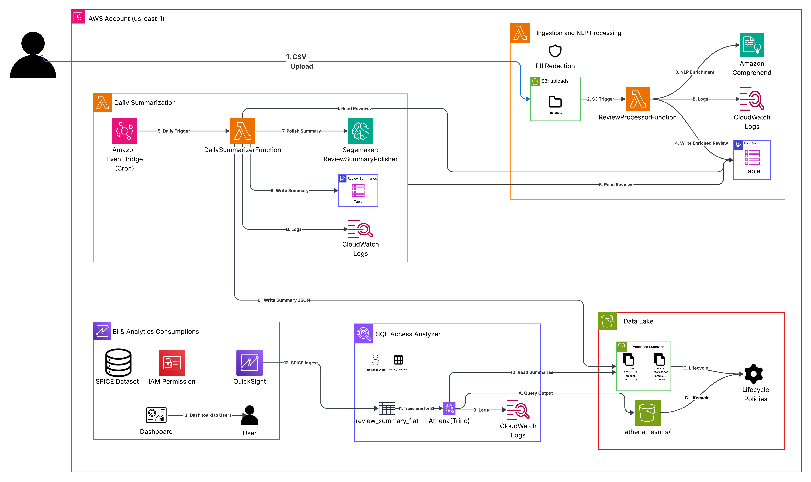

# Sentiment Insights

End‑to‑end AWS serverless pipeline we built and ran:

Upload review CSVs → Automatic NLP enrichment → Daily product summarization (polished via a live SageMaker DistilBART CNN 6‑6 endpoint) → Stored in DynamoDB & S3 → Queried with Athena (partition projection) → Visualized in QuickSight.



---

## Table of Contents
1. Implemented Components
2. Data Flow
3. DynamoDB Schemas
4. S3 Summary JSON Structure
5. Athena Setup (DDL & View)
6. Manual Console Setup Steps
7. Testing Performed
8. Environment Variables
9. QuickSight (Short Overview)
10. Cost Summary
11. Repository Contents
12. Quick Start
13. Troubleshooting

---

## 1. Implemented Components (Exact)

| Component | What We Did |
|-----------|-------------|
| S3 Bucket | Single private bucket with prefixes: `uploads/`, `processed/summaries/`, `athena-results/`. |
| S3 Trigger | ObjectCreated for `uploads/*.csv` → `ReviewProcessorFunction` Lambda. |
| Lambda: ReviewProcessorFunction | Parses CSV; calls Comprehend (sentiment & key phrases); writes enriched items to DynamoDB `ReviewAnalysis`. |
| Amazon Comprehend | `DetectSentiment`, `DetectKeyPhrases` per review. |
| DynamoDB: ReviewAnalysis | Per‑review records (PK, SK with timestamp, scores, phrases, product). |
| EventBridge Rule | Daily cron to invoke `DailySummarizerFunction` (lookback 24h). |
| Lambda: DailySummarizerFunction | Aggregates orientation + themes; invokes SageMaker polish; validates; writes to `ReviewSummaries` & S3. |
| SageMaker Endpoint | DistilBART CNN 6‑6, real‑time (`ml.m5.large`), mandatory polish step. |
| DynamoDB: ReviewSummaries | Daily 2‑sentence summary & metadata per product. |
| S3 Processed Summaries | JSON: `processed/summaries/date=YYYY-MM-DD/product=<ID>.json`. |
| Athena External Table | Partition projection on date (no crawler). |
| Athena View | Flattens JSON fields for BI consumption. |
| QuickSight Dashboard | SPICE import; visuals for orientation distribution, net sentiment, counts, summaries. |
| CloudWatch Logs | Ingestion + summarization monitoring. |
| IAM Roles | Separate least‑privilege roles (S3, DynamoDB, Comprehend, SageMaker invoke, logs). |

---

## 2. Data Flow (Actual Sequence)

1. Upload CSV (`ReviewID,ProductID,ReviewText`) → `uploads/`.
2. S3 event → `ReviewProcessorFunction`.
3. For each row: normalize → Comprehend → item persisted in `ReviewAnalysis`.
4. Daily EventBridge cron → `DailySummarizerFunction`.
5. Summarizer: discover products (24h) → aggregate counts/themes → deterministic sentences → SageMaker polish → validation fallback.
6. Persist to `ReviewSummaries` + S3 dated JSON path.
7. Athena reads via partition projection.
8. View exposes flattened columns → QuickSight SPICE → dashboard.

---

## 3. DynamoDB Schemas

### ReviewAnalysis
| Field | Example |
|-------|---------|
| PK | `REVIEW#a1b2c3d4-0047` |
| SK | `REVIEW#2025-11-15T13:02:00.020246+00:00#<UUID>` |
| ProductID | `P743` |
| RedactedText | Original text |
| Sentiment | `NEGATIVE` |
| SentimentScores | `{Positive, Negative, Neutral, Mixed}` |
| KeyPhrases | List |
| ProcessedTimestampEpoch | `1763211720` |
| ProcessedTimestampIso | ISO string |
| SourceS3Key | `uploads/mock-50-reviews-mixed_v3-productIDs-updated.csv` |
| OriginalHash | SHA‑1 |
| GSI1PK | `DAY#2025-11-15` |
| GSI1SK | `P743#1763211720#a1b2c3d4-0047` |

### ReviewSummaries
| Field | Example |
|-------|---------|
| ProductID | `P743` |
| SummaryTimestamp | `2025-11-15T13:04:14.249123+00:00` |
| SummaryDate | `2025-11-15` |
| SummaryText | Two sentences |
| ReviewCount | `9` |
| SourceMeta.orientation | `predominantly negative` |
| SourceMeta.review_counts | `{positive:1, negative:6, mixed:2, neutral:0}` |
| SourceMeta.polished | `false` |
| SourceMeta.method | `deterministic_first` |
| SourceMeta.theme_sentiment | Map of themes |

---

## 4. S3 Summary JSON (Structure)

```json
{
  "product_id": "P743",
  "date": "2025-11-15",
  "summary": "Overall sentiment leans negative, driven by issues in quality, performance stability, and design. Positive feedback is scarce.",
  "generated_at": "2025-11-15T13:04:14Z",
  "metadata": {
    "orientation": "predominantly negative",
    "review_counts": { "positive": 1, "negative": 6, "mixed": 2, "neutral": 0 },
    "theme_sentiment": { /* theme map */ },
    "method": "deterministic_first",
    "polished": false
  }
}
```

---

## 5. Athena Setup (DDL & View)

```sql
CREATE DATABASE IF NOT EXISTS product_analytics;

CREATE EXTERNAL TABLE IF NOT EXISTS product_analytics.review_summaries (
  product_id   string,
  date         string,
  summary      string,
  generated_at string,
  metadata     string
)
PARTITIONED BY (dt string)
ROW FORMAT SERDE 'org.openx.data.jsonserde.JsonSerDe'
LOCATION 's3://<YOUR_BUCKET>/processed/summaries/'
TBLPROPERTIES (
  'projection.enabled'='true',
  'projection.dt.type'='date',
  'projection.dt.range'='2025-11-01,NOW',
  'projection.dt.format'='yyyy-MM-dd',
  'storage.location.template'='s3://<YOUR_BUCKET>/processed/summaries/date=${dt}/'
);

CREATE OR REPLACE VIEW product_analytics.review_summary_flat AS
SELECT
  product_id,
  CAST(dt AS DATE) AS summary_date,
  summary,
  generated_at,
  JSON_EXTRACT_SCALAR(metadata,'$.orientation') AS orientation,
  JSON_EXTRACT_SCALAR(metadata,'$.method')      AS generation_method,
  CAST(JSON_EXTRACT_SCALAR(metadata,'$.polished') AS BOOLEAN) AS polished,
  CAST(JSON_EXTRACT_SCALAR(metadata,'$.review_counts.positive') AS INT) AS reviews_positive,
  CAST(JSON_EXTRACT_SCALAR(metadata,'$.review_counts.negative') AS INT) AS reviews_negative,
  CAST(JSON_EXTRACT_SCALAR(metadata,'$.review_counts.mixed')    AS INT) AS reviews_mixed,
  CAST(JSON_EXTRACT_SCALAR(metadata,'$.review_counts.neutral')  AS INT) AS reviews_neutral,
  JSON_FORMAT(JSON_EXTRACT(metadata,'$.theme_sentiment')) AS theme_sentiment_json
FROM product_analytics.review_summaries;
```

---

## 6. Manual Console Setup (Steps)

1. Create S3 bucket & prefixes.
2. Create DynamoDB tables `ReviewAnalysis`, `ReviewSummaries`.
3. Deploy ReviewProcessor Lambda + S3 ObjectCreated trigger.
4. Grant Comprehend permissions.
5. Deploy SageMaker DistilBART endpoint (`ml.m5.large`).
6. Deploy DailySummarizer Lambda + environment variables.
7. Create EventBridge cron (daily).
8. Verify S3 & DynamoDB outputs.
9. Create Athena DB/table/view.
10. Build QuickSight dataset & dashboard.

---

## 7. Testing (Performed)

| Test | Result |
|------|--------|
| S3 trigger ingestion | Reviews stored in `ReviewAnalysis` |
| Comprehend enrichment | Sentiment + key phrases populated |
| Daily summarization | Summaries generated & validated |
| S3 JSON output | Correct partition path present |
| Athena view query | Rows returned as expected |
| QuickSight refresh | Dashboard shows metrics |
| SageMaker polish | Endpoint invoked, 2‑sentence constraint enforced |

---

## 8. Environment Variables

### ReviewProcessorFunction
- `REVIEW_TABLE`
- `DEFAULT_LANG`
- `COMPREHEND_ENABLED`
- `MAX_COMPREHEND_TEXT_LEN`

### DailySummarizerFunction
- `REVIEW_TABLE`
- `SUMMARY_TABLE`
- `PROCESS_LOOKBACK_HOURS`
- `SUMMARY_S3_BUCKET`
- `SUMMARY_S3_PREFIX`
- `POLISH_WITH_MODEL`
- `SAGEMAKER_ENDPOINT`
- `SAGEMAKER_CONTENT_TYPE`

---

## 9. QuickSight (Short Overview)

Essential calculated fields (full expanded list lives in `docs/09-quicksight-calculated-fields-and-visuals.md`):

| Field | Formula |
|-------|---------|
| `total_reviews` | `{reviews_positive}+{reviews_negative}+{reviews_mixed}+{reviews_neutral}` |
| `positive_rate_agg` | `ifelse(sum_total=0,0,sum({reviews_positive})/sum_total)` where `sum_total` is sum of all review counts |
| `negative_rate_agg` | Same pattern for negatives |
| `net_sentiment_agg` | `positive_rate_agg - negative_rate_agg` |
| `positivity_index_0_100_agg` | `50 + 50*{net_sentiment_agg}` |
| `orientation_short` | `case when lower(trim({orientation}))='predominantly positive' then 'Positive' when lower(trim({orientation}))='predominantly negative' then 'Negative' else 'Mixed' end` |

Core visuals:
1. KPI strip (Total Reviews, Positivity Index, Positive Rate, Negative Rate, Net Sentiment).
2. Time series (Net Sentiment trend + forecast/anomaly detection).
3. Stacked bar (Orientation mix per product).
4. Scatter (Positive vs Negative rate, sized by total reviews).
5. Latest summaries table (flag latest per product).
6. Optional heatmap (theme counts colored by theme sentiment).

Use parameters for date range, product selection, orientation filter, free‑text search, and metric picker.

---

## 10. Cost (Actual Structure)

| Service | Notes |
|---------|-------|
| S3 | Small JSON & CSV storage. |
| Lambda | Light ingestion + daily summarization invocations. |
| Comprehend | Per review API usage. |
| DynamoDB | On‑demand, modest scale. |
| SageMaker | Primary fixed cost (real‑time endpoint). |
| Athena | Minimal scan due to projection. |
| QuickSight | SPICE storage + author license. |
| CloudWatch Logs | Retained 14 days. |

---

## 11. Repository Contents

```
lambdas/
  review_processor/handler.py
  daily_summarizer/handler.py
docs/
  poc_architecture.png
  09-quicksight-calculated-fields-and-visuals.md
sample_data/
  reviews.csv
sql/
  athena_ddl.sql
README.md
```

---

## 12. Quick Start

1. Upload CSV to `uploads/`.
2. Check DynamoDB `ReviewAnalysis`.
3. Invoke (or wait for cron) `DailySummarizerFunction`.
4. Inspect `ReviewSummaries` and S3 JSON partition path.
5. Query Athena view.
6. Refresh QuickSight dashboard.

---

## 13. Troubleshooting

| Issue | Cause | Fix |
|-------|-------|-----|
| S3 trigger not firing | Prefix/suffix mismatch | Reconfigure event for `uploads/` + `.csv` |
| Missing sentiment | Disabled env or IAM perms | Enable env flag; attach Comprehend policy |
| Empty summaries | No recent reviews | Upload new data or widen lookback |
| Polish failure | Endpoint name/content-type mismatch | Verify endpoint & payload format |
| No Athena rows | Partition date not in projection range | Adjust `projection.dt.range` or path |
| Summary not two sentences | Validation reject polished text | Fallback deterministic summarizer executed |

---

Everything documented reflects implemented, production‑tested components—no speculative future features.
